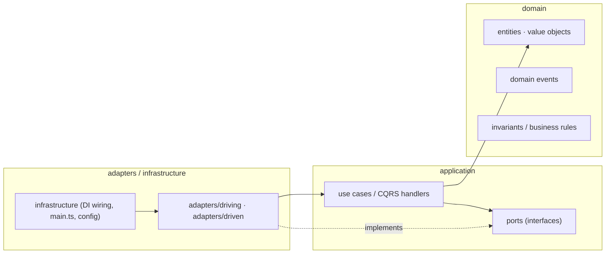
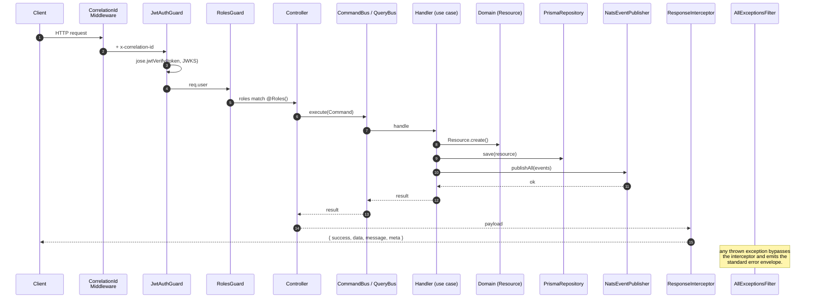
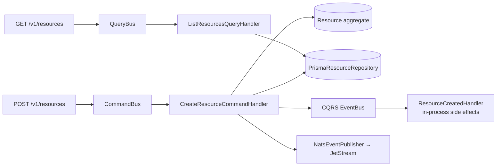
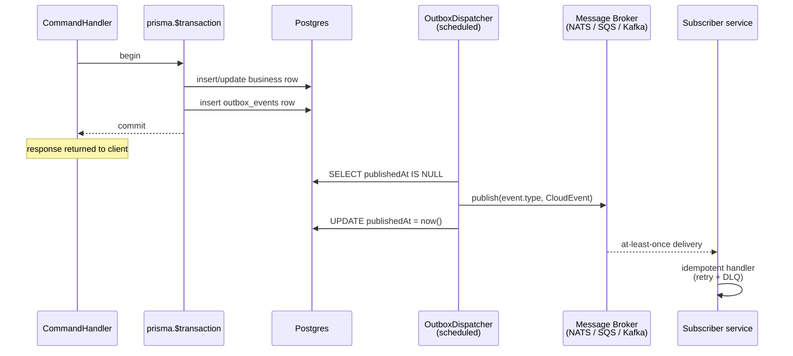
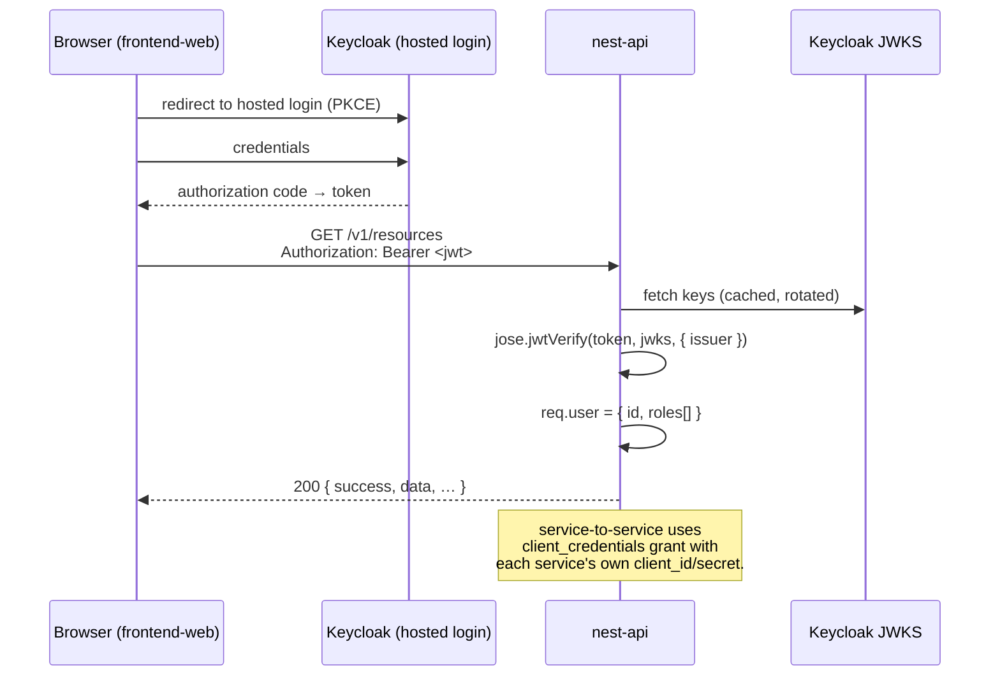
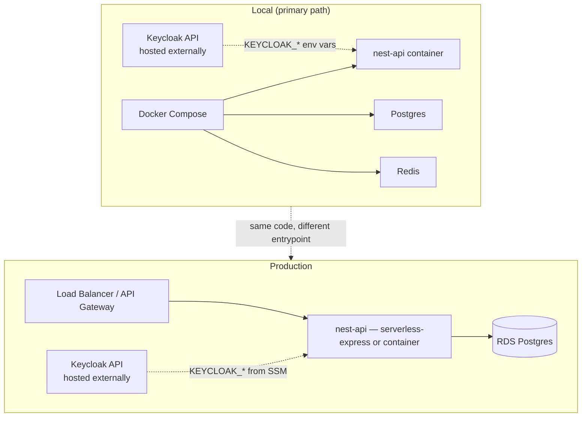
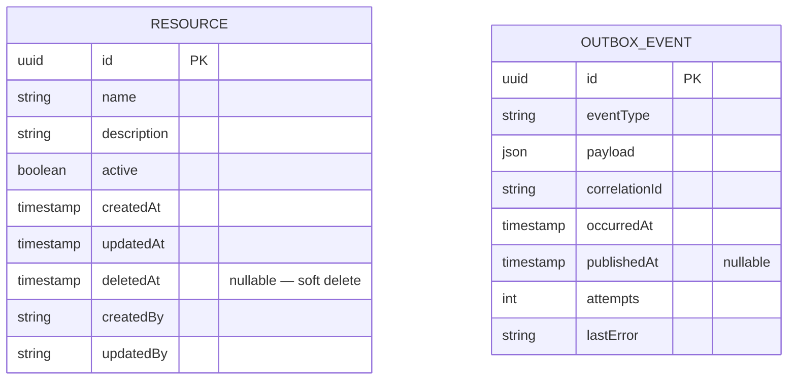

# Architecture

This boilerplate combines **Hexagonal (Ports & Adapters)**, **Onion**, **DDD**, **SOA**, and **Event-Driven** styles into one consistent layering. They describe the same shape from different angles — do not duplicate layers.

---

## 1. The dependency rule (most important thing)

Code on an outer layer may depend on code on an inner layer. **Inner layers must never depend on outer layers.**



What this buys you:

- **Testability** — domain & application can be tested with no infrastructure.
- **Swappability** — Prisma → another ORM, local publisher → any broker (NATS, SQS, Kafka…), REST → gRPC, all without touching business logic.
- **Boundary enforcement is automatic** — `eslint-plugin-boundaries` in `.eslintrc.cjs` fails CI on a forbidden import.

---

## 2. Layers in detail

### `src/core/domain/` — the business heart

Pure TypeScript. **Zero** decorators from NestJS, Prisma, Swagger, or class-validator.

- **Aggregate roots** extend `AggregateRoot`, expose state via readonly getters, validate invariants in static `create()` factories, and emit domain events.
- **Value objects** extend `ValueObject<TProps>`, are immutable, and define equality structurally.
- **Domain events** extend `DomainEvent<T>` and follow the **CloudEvents 1.0** shape (`id`, `source`, `type`, `specversion`, `time`, `datacontenttype`, `data`).
- **Exceptions** follow a KISS hierarchy: `BaseException` → `DomainException` { `ValidationException`, `BusinessRuleException`, `EntityNotFoundException` } / `ApplicationException` / `InfrastructureException`.

### `src/core/application/` — orchestration

- **Ports** are interfaces declared from the use case's point of view:
  - _Outbound ports_ — repository, event publisher, external service gateways.
  - _Inbound ports_ — the use case itself, called by a driving adapter.
- **CQRS** separates writes from reads from day one:
  - `<Verb>Command` + `<Verb>CommandHandler` for writes.
  - `<Noun>Query` + `<Noun>QueryHandler` for reads.
  - `@EventsHandler(<DomainEvent>)` for in-process side effects.

### `src/adapters/` — the outside world

- `driving/http/<feature>/` — controllers, request/response DTOs, Swagger decorators. Controllers **translate** HTTP into CQRS messages; they do not contain business logic.
- `driven/prisma/` — repository implementations against Postgres.
- `driven/local/` — no-op `LocalEventPublisher`. Swap for a real broker adapter (NATS, SQS, Kafka…) by implementing `IEventPublisher` and rebinding the `EVENT_PUBLISHER` token.
- `driven/legacy/` (add when needed) — anti-corruption HTTP clients that wrap legacy APIs as SDKs behind a port. Domain never touches them directly.

### `src/common/` — framework-aware utilities

Cross-cutting Nest pieces with no business semantics: `AllExceptionsFilter`, `ResponseTransformInterceptor`, `LoggingInterceptor`, `CorrelationIdMiddleware`, `JwtAuthGuard`, `RolesGuard`, decorators.

### `src/infrastructure/` — composition

Zod-validated config, the root `AppModule`, feature modules wiring CQRS handlers, `main.ts` (server) and `lambda.ts` (handler).

---

## 3. Request lifecycle



---

## 4. CQRS — writes vs reads



**Why both an in-process EventBus and an external publisher?** They have different jobs: the EventBus is cheap, synchronous, and stays inside the process (audit logs, cache busts, local projections). The `IEventPublisher` port is the integration event channel for other services — currently backed by `LocalEventPublisher` (logs only). Wire in a real broker (NATS, SQS, Kafka…) by implementing the port and rebinding `EVENT_PUBLISHER`. Production deployments should use the **transactional outbox** pattern for at-least-once delivery — the `OutboxEvent` Prisma model is included for that.

---

## 5. Event flow with transactional outbox



---

## 6. Auth flow (Keycloak SSO)



---

## 7. Deployment topology



`src/infrastructure/main.ts` (server) and `src/infrastructure/lambda.ts` (serverless-express) share the same `AppModule` — runtime-agnostic.

---

## 8. Folder map (canonical)

```
src/
├─ core/
│  ├─ domain/<feature>/       ← entities · VOs · events · exceptions (pure TS)
│  └─ application/
│     ├─ ports/               ← repository/event/gateway interfaces
│     └─ <feature>/           ← command + query handlers
├─ adapters/
│  ├─ driving/http/<feature>/ ← controller + DTOs (Swagger here only)
│  └─ driven/
│     ├─ prisma/              ← repos implementing ports
│     └─ local/               ← LocalEventPublisher (no-op; swap for real broker)
├─ common/                    ← filter · interceptor · guard · decorator · middleware
└─ infrastructure/            ← config · modules · main.ts · lambda.ts
```

---

## 9. ER diagram (example slice)



The outbox table lives **with** the business data so writes and event records share one transaction.

---

## 10. Cross-cutting concerns and where they live

| Concern                  | Mechanism                                        | File                                                        |
| ------------------------ | ------------------------------------------------ | ----------------------------------------------------------- |
| Config validation        | Zod, fail-fast at boot                           | `src/infrastructure/config/env.ts`                          |
| Request correlation      | Middleware → `x-correlation-id` header           | `src/common/middleware/correlation-id.middleware.ts`        |
| Structured logging       | `nestjs-pino` JSON stdout                        | configured in `AppModule`                                   |
| Authentication           | JWKS local JWT verify via `jose`                 | `src/common/guards/jwt-auth.guard.ts`                       |
| Authorization            | Role match against JWT claims                    | `src/common/guards/roles.guard.ts`                          |
| Validation               | Global `ValidationPipe` + `class-validator` DTOs | `AppModule`                                                 |
| Response shape           | `ResponseTransformInterceptor`                   | `src/common/interceptors/response-transform.interceptor.ts` |
| Error handling           | `AllExceptionsFilter`                            | `src/infrastructure/filters/all-exceptions.filter.ts`       |
| Rate limiting            | `@nestjs/throttler`, configurable per-env        | `AppModule`                                                 |
| Security headers         | `helmet`                                         | `main.ts`                                                   |
| CORS                     | Per-env allowed origins                          | `main.ts`                                                   |
| API versioning           | URL `/v1`                                        | `main.ts`                                                   |
| Health                   | `GET /v1/health` (minimal liveness)              | `src/infrastructure/health/health.controller.ts`            |
| Tracing (off by default) | OpenTelemetry → OTLP/Honeycomb                   | env-gated                                                   |
| Error tracking           | Sentry, DSN-gated                                | `@sentry/nestjs`                                            |

See **[CONTRIBUTING.md](./CONTRIBUTING.md)** for the step-by-step "add a new vertical slice" recipe.
